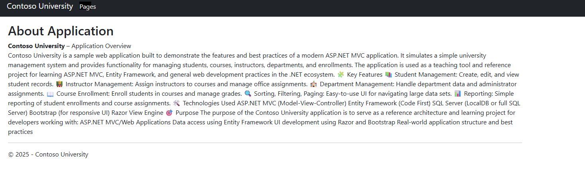
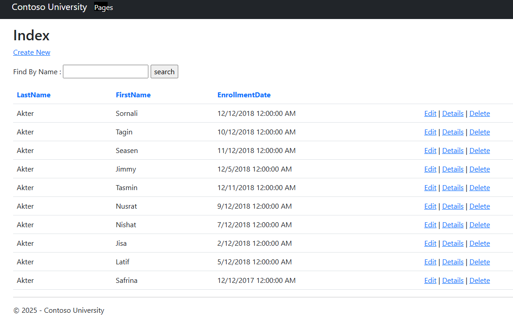
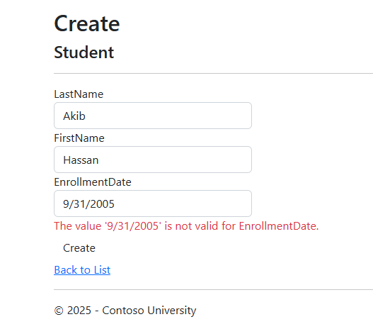
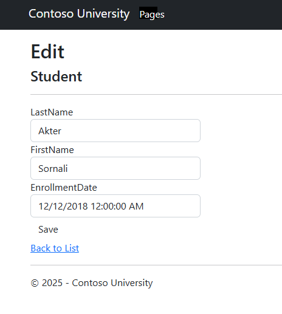
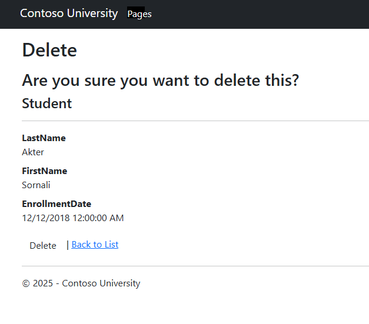
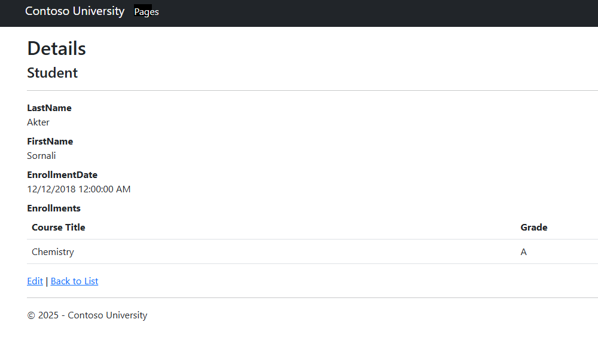
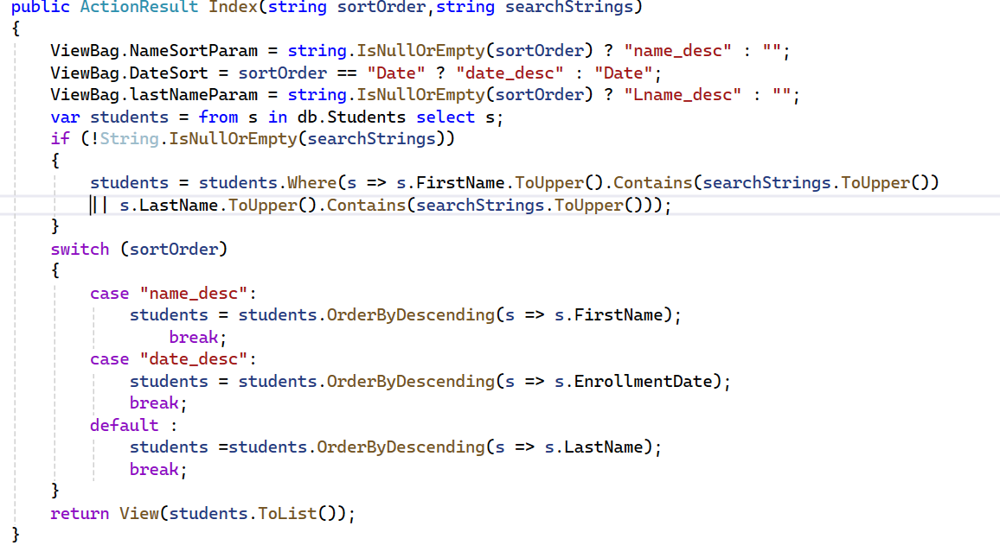
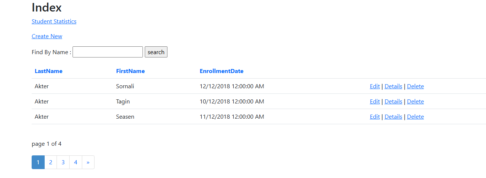
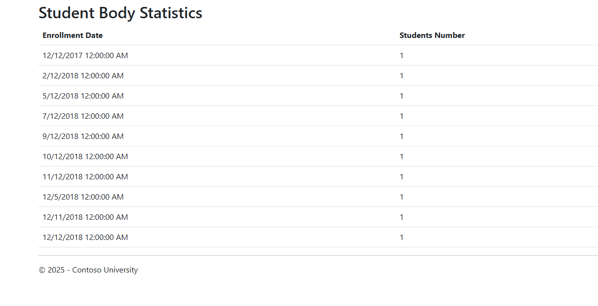

# EntityFrameworkCodeFirstUsingMVC
 
```
Home page :

```


```

About App:

```

```
Student Index:

```


```
Student create:

```



```
Student Edit:

```


```
Student Delete:

```



```
Student Details:

```




```
searching and sorting:

```



```
Paged List:

```




```
Student Statistics:

```




