🎓 Contoso University

🔹 Contoso University is a sample university management system built with ASP.NET MVC  and Entity Framework Code First.
🔹 Demonstrates CRUD operations, relationships, validation, and database migrations.
🔹 Showcases my skills in C#, SQL Server, MVC architecture, and full-stack web development.

📌 Features

✔ Student Management – Add, update, delete, and view students.
✔ Course Management – Define courses, assign credits, and manage course details.
✔ Enrollment Management – Track students enrolled in specific courses.
✔ Instructor Management – Assign instructors to courses.
✔ Validation – Both server-side and client-side validation with data annotations.
✔ Database Migrations – Code First with migrations and seed data.
✔ Responsive UI – Powered by Bootstrap.

🛠️ Technologies Used

ASP.NET MVC 

C#

Entity Framework 6 (Code First with Migrations)

SQL Server / LocalDB

Bootstrap 

jQuery & JavaScript

🚀 Getting Started
🔹 Prerequisites

Visual Studio 2019/2022 (Community or higher)

.NET Framework 4.8

SQL Server / LocalDB

🔹 Installation

Clone the repository:

git clone https://github.com/username/ContosoUniversity.git


Open the solution in Visual Studio.

Run the migrations from Package Manager Console:

update-database


Press F5 to build and run the project.

📂 Project Structure
ContosoUniversity/
│
├── Controllers/         # MVC Controllers (Student, Course, Enrollment,Instructor,Department etc.)
├── DAL/                 # Data Access Layer (DbContext, Repositories)
├── Models/              # Entity classes (Student, Course, Enrollment, Instructor)
├── ViewModels/          # Entity classes
├── Migrations/          # EF Code First Migrations
├── Views/               # Razor Views for UI
├── Scripts/             # JavaScript & jQuery files
├── Content/             # CSS, Bootstrap, and static assets
├─── Global.asax         # Application configuration
└── webconfig            # ConnectionStrings

📖 Learning Objectives

This project demonstrates:

* Structuring an ASP.NET MVC application

* Using Entity Framework Code First with Migrations

* Implementing CRUD operations

* Working with entity relationships (one-to-many, many-to-many)

* Validation with Data Annotations (client-side & server-side)

* Using ViewModels for complex data presentation

* Applying Repository & Unit of Work patterns (optional advanced scenario)

📸 Screenshots

```
Home page :

```

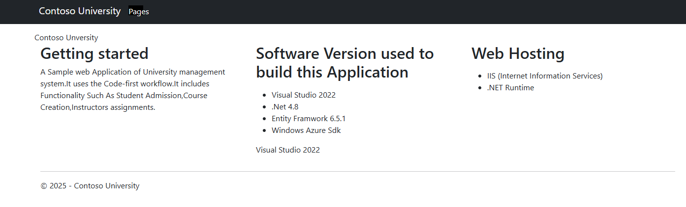

```

About App:

```
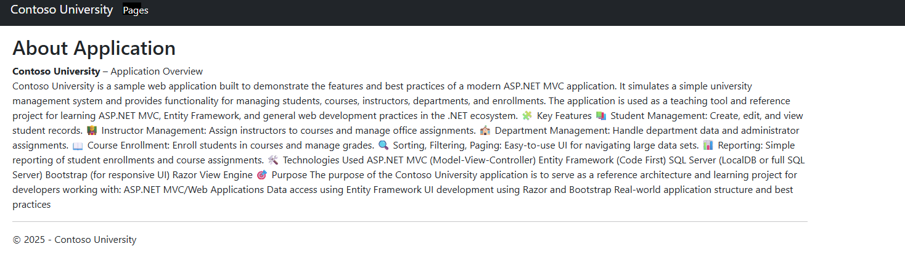
```
Student Index:

```

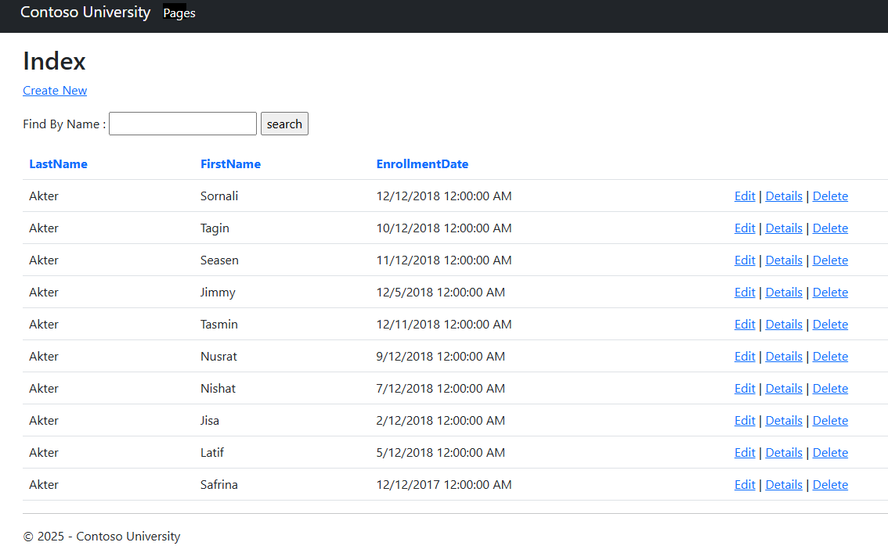
```
Student create:

```

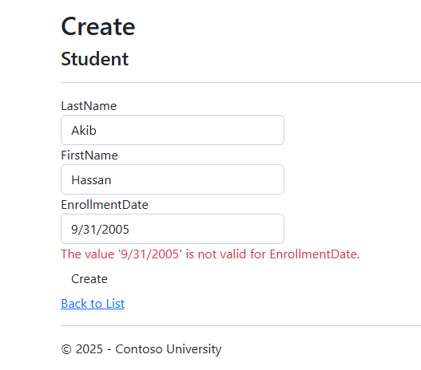

```
Student Edit:

```

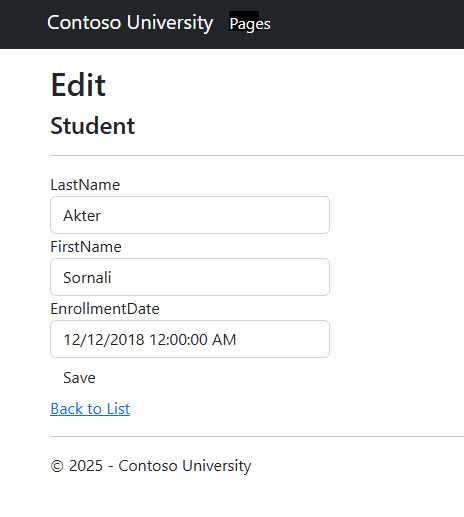
```
Student Delete:

```

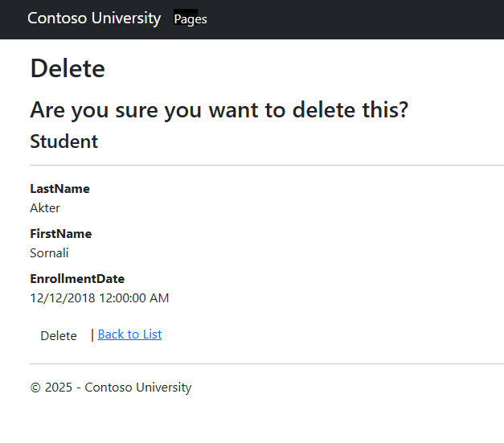

```
Student Details:

```

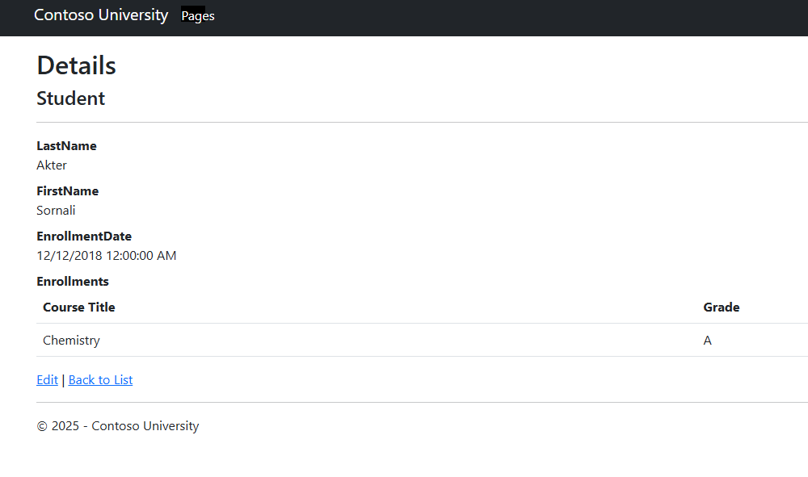


```
searching and sorting:

```

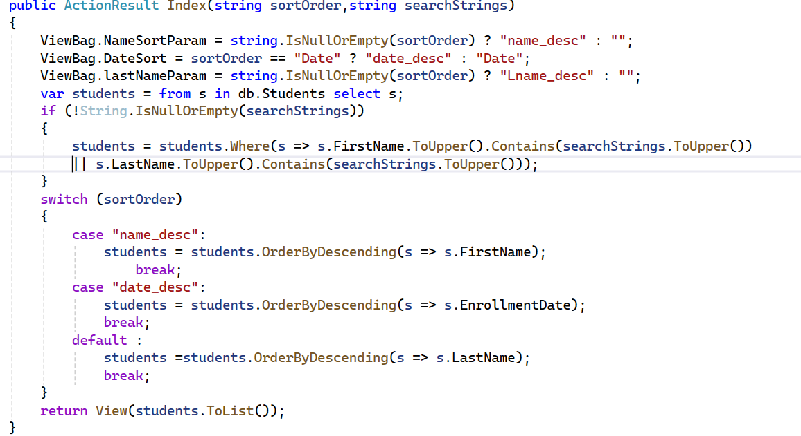

```
Paged List:

```

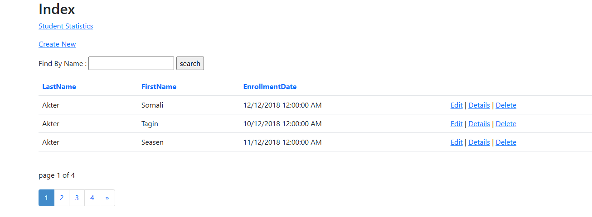


```
Student Statistics:

```

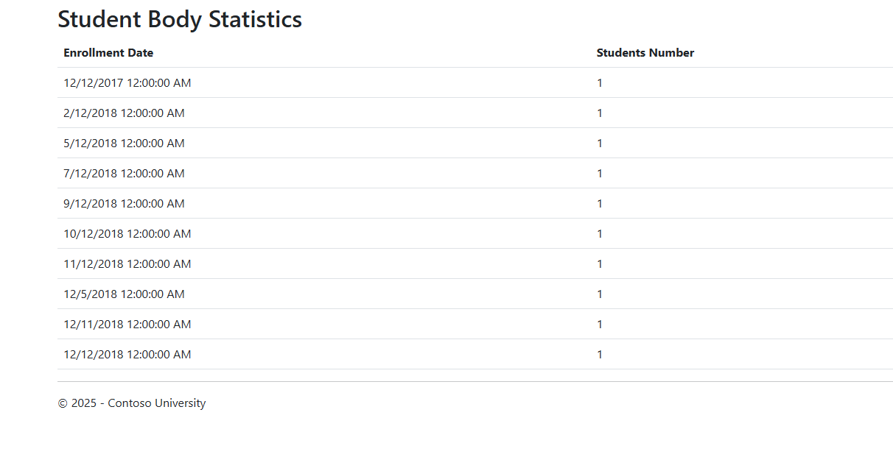

```
Instructor:

```

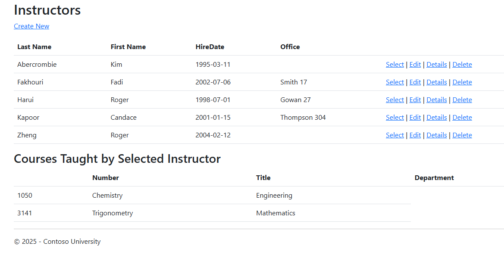


```
ClientSide Validation:

```

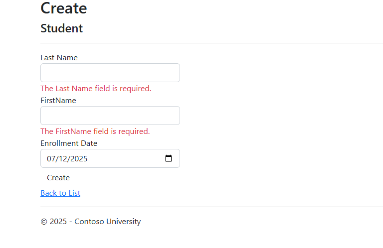

```
Create Instructor with course & Location:

```

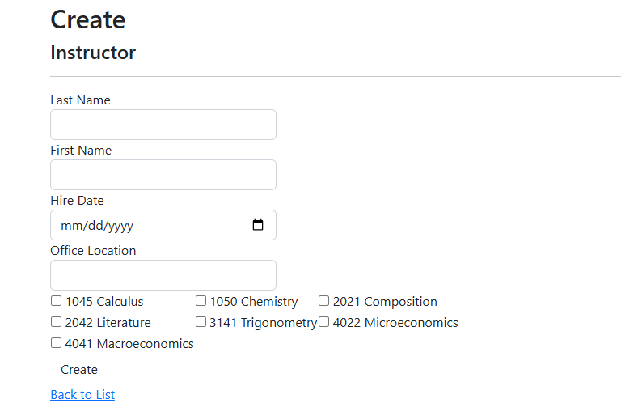


🤝 Contribution

Contributions are welcome!
If you’d like to enhance the project (e.g., add APIs, improve UI, or optimize queries), feel free to:(***give marge Commit.)

Fork the repo

Create a branch (feature/your-feature)

Commit your changes

Push to your fork

Open a Pull Request

📜 License

This project is licensed under the MIT License.
You’re free to use, modify, and distribute for learning and personal projects.
 


